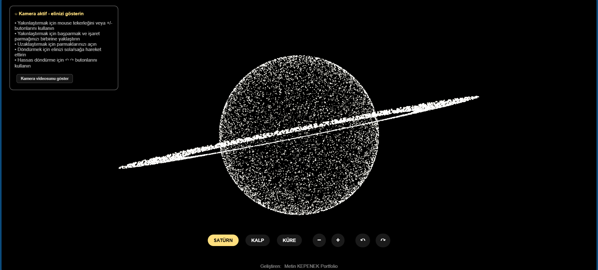
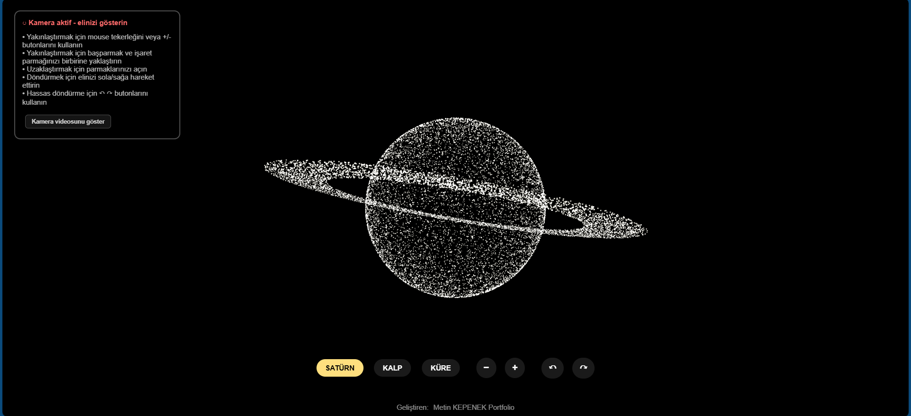
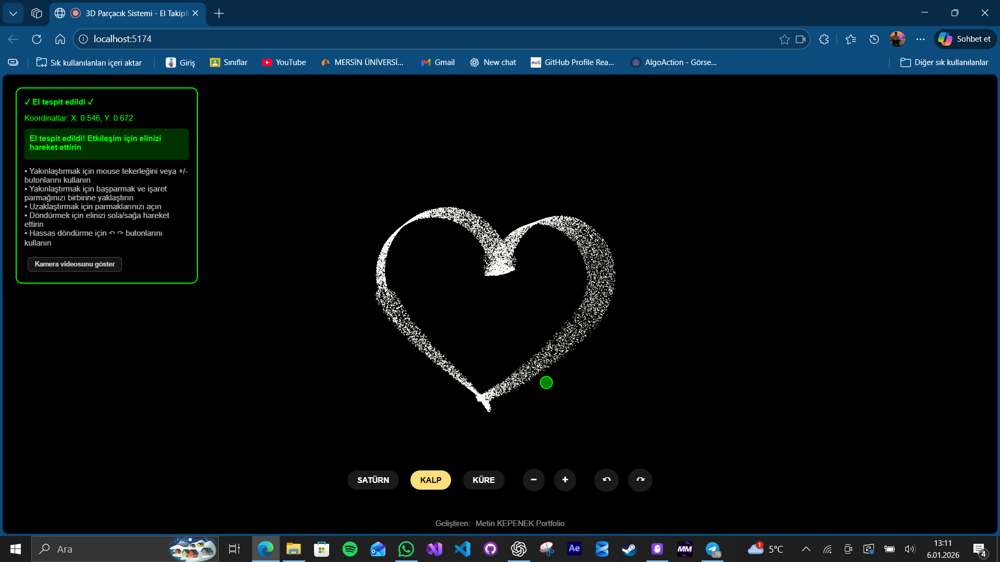
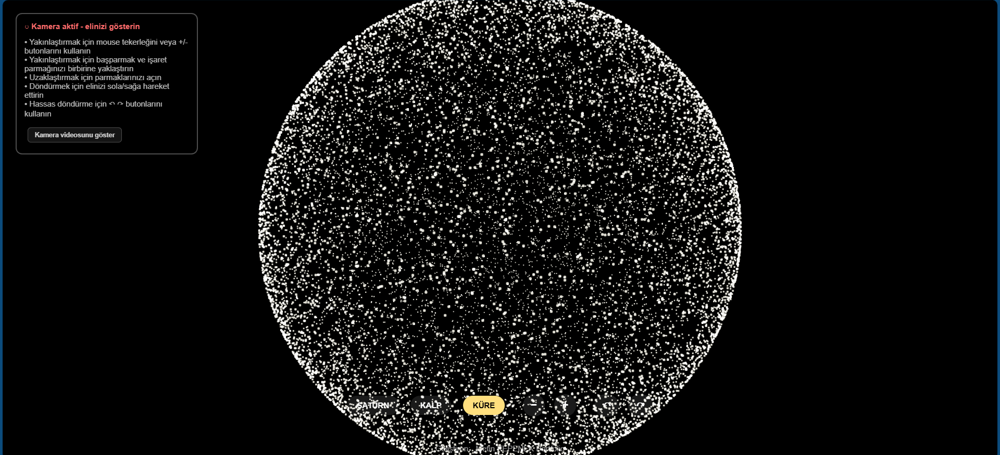
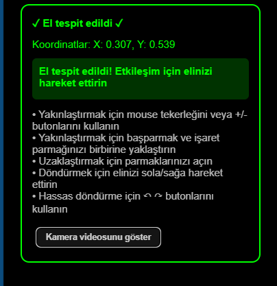

# 🌟 3D Parçacık Sistemi - El Takipli Etkileşim

> Modern web teknolojileri ile yapay zeka tabanlı el takibi kullanarak 3D parçacık sistemleri ile etkileşime geçebileceğiniz interaktif bir web uygulaması.


## 🚀 Özellikler

### 🎮 **Etkileşimli Kontroller**
- **3 Farklı Şekil**: Satürn, Kalp ve Küre geometrileri
- **El Takibi**: MediaPipe AI ile gerçek zamanlı el tespiti
- **Jestiküler Kontrol**: 
  - 🤏 Parmak kıstırma ile zoom
  - 👋 El hareketi ile rotasyon
  - ✋ El yaklaştırma ile parçacık itme efekti

### 📱 **Responsive Tasarım**
- Mobil, tablet ve masaüstü uyumlu
- Dokunmatik kontroller
- Adaptive UI bileşenleri

### 🎨 **Görsel Efektler**
- 15.000 parçacık ile yoğun görsel deneyim
- Gerçek zamanlı parçacık etkileşimi
- Yumuşak geçiş animasyonları
- Işık efektleri (Additive Blending)

## 📸 Ekran Görüntüleri

### Ana Arayüz


### Şekil Çeşitleri
| Satürn | Kalp | Küre |
|--------|------|------|
|  |  |  |

### El Takibi


## 🛠️ Kurulum

### Gereksinimler
- Node.js (v16 veya üzeri)
- Modern tarayıcı (Chrome, Firefox, Safari, Edge)
- Kamera erişimi

### Adımlar

1. **Projeyi klonlayın:**
```bash
git clone [proje-url]
cd 3d-parcacik-sistemi
```

2. **Bağımlılıkları yükleyin:**
```bash
npm install
```

3. **Geliştirme sunucusunu başlatın:**
```bash
npm run dev
```

4. **Tarayıcıda açın:**
```
http://localhost:5173
```

## 📱 Mobil Kullanım

### HTTPS Gereksinimi
Mobil cihazlarda kamera erişimi için HTTPS gereklidir.

#### Ngrok ile HTTPS (Önerilen)
```bash
# Terminal 1
npm run dev

# Terminal 2
ngrok http 5173
```

Ngrok'un verdiği HTTPS URL'ini mobil cihazda açın.

#### Aynı WiFi Ağında
```bash
npm run dev -- --host
```
Mobil cihazda: `http://[bilgisayar-ip]:5173`

## 🎮 Kontroller

### 👋 **El Hareketleri**
- **Zoom**: Başparmak ve işaret parmağını kıstırın/açın
- **Rotasyon**: Elinizi sağa/sola hareket ettirin  
- **İtme Efekti**: Elinizi parçacıklara yaklaştırın

### 🖱️ **Mouse/Klavye**
- **Mouse Wheel**: Zoom in/out
- **+/- Butonları**: Manuel zoom
- **↶ ↷ Butonları**: Manuel rotasyon

### 📱 **Dokunmatik**
- **Şekil Butonları**: SATÜRN, KALP, KÜRE
- **Zoom Kontrolleri**: + ve - butonları
- **Rotasyon Kontrolleri**: Yön butonları

## 🏗️ Build ve Deploy

### Production Build
```bash
npm run build
```

### Build Önizleme
```bash
npm run preview
```

### Netlify Deploy
```bash
npm run build
npx netlify deploy --prod --dir dist
```

### Vercel Deploy
```bash
npm run build
npx vercel --prod
```

## 🔧 Teknoloji Stack

### Frontend Framework
- **React 18**: Modern UI framework
- **Vite**: Hızlı geliştirme ortamı
- **JSX**: Bileşen tabanlı geliştirme

### 3D Grafik
- **Three.js**: WebGL tabanlı 3D grafik
- **React Three Fiber**: React için Three.js wrapper
- **React Three Drei**: Yardımcı 3D bileşenleri

### Yapay Zeka
- **MediaPipe Hands**: Google'ın el takibi AI'ı
- **21 Landmark**: El üzerinde 21 nokta tespiti
- **Real-time Processing**: 30+ FPS gerçek zamanlı işleme

### Styling
- **CSS3**: Modern CSS özellikleri
- **Responsive Design**: Mobile-first yaklaşım
- **CSS Grid & Flexbox**: Layout sistemi

## 📁 Proje Yapısı

```
3d-parcacik-sistemi/
├── public/
│   └── logo.svg
├── src/
│   ├── App.jsx          # Ana uygulama bileşeni
│   ├── App.css          # Responsive stiller
│   ├── main.jsx         # Giriş noktası
│   └── index.css        # Global stiller
├── images/              # Ekran görüntüleri
├── index.html           # HTML şablonu
├── vite.config.js       # Vite yapılandırması
└── package.json         # Proje bağımlılıkları
```

## 🎯 Özellik Detayları

### Parçacık Sistemi
- **15.000 Parçacık**: Yoğun görsel deneyim
- **Float32Array**: Performans optimizasyonu
- **Yumuşak Geçişler**: 0.08 faktörü ile smooth animasyon
- **Mesafe Tabanlı Etkileşim**: 4.0 birim etkileşim yarıçapı

### El Takibi
- **MediaPipe Integration**: Google'ın AI teknolojisi
- **21 Landmark**: Detaylı el haritası
- **Koordinat Dönüşümü**: MediaPipe → Three.js
- **Gesture Recognition**: Pinch ve swipe tespiti

### Responsive Tasarım
- **Desktop**: Tam özellikli arayüz
- **Tablet (≤768px)**: Orta boyut optimizasyonu  
- **Mobile (≤480px)**: Dokunmatik optimizasyonu
- **Tiny (≤360px)**: Çok küçük ekran desteği

## 🐛 Sorun Giderme

### Kamera Erişimi Sorunları
```javascript
// Tarayıcı desteği kontrolü
if (!navigator.mediaDevices) {
  console.error('Tarayıcı kamera erişimini desteklemiyor');
}
```

### Performance Sorunları
- Parçacık sayısını azaltın (COUNT değişkeni)
- Model karmaşıklığını düşürün (modelComplexity: 0)
- Frame rate'i sınırlayın

### HTTPS Sorunları
- Ngrok kullanın
- Localhost dışında HTTPS gerekli
- Self-signed sertifika uyarılarını kabul edin

## 🤝 Katkıda Bulunma

1. Fork yapın
2. Feature branch oluşturun (`git checkout -b feature/amazing-feature`)
3. Commit yapın (`git commit -m 'Add amazing feature'`)
4. Push yapın (`git push origin feature/amazing-feature`)
5. Pull Request açın

## 📄 Lisans

Bu proje MIT lisansı altında lisanslanmıştır. Detaylar için `LICENSE` dosyasına bakın.

## 👨‍💻 Geliştirici

**Metin KEPENEK**
- 🌐 Portfolio: [metinkpnk.github.io/PortfolioSayfam](https://metinkpnk.github.io/PortfolioSayfam/)
- 📧 Email: [email]
- 💼 LinkedIn: [linkedin-profile]

## 🙏 Teşekkürler

- **Google MediaPipe**: El takibi teknolojisi
- **Three.js Community**: 3D grafik desteği
- **React Team**: Modern UI framework
- **Vite Team**: Hızlı geliştirme ortamı

---

⭐ **Bu projeyi beğendiyseniz yıldız vermeyi unutmayın!**


